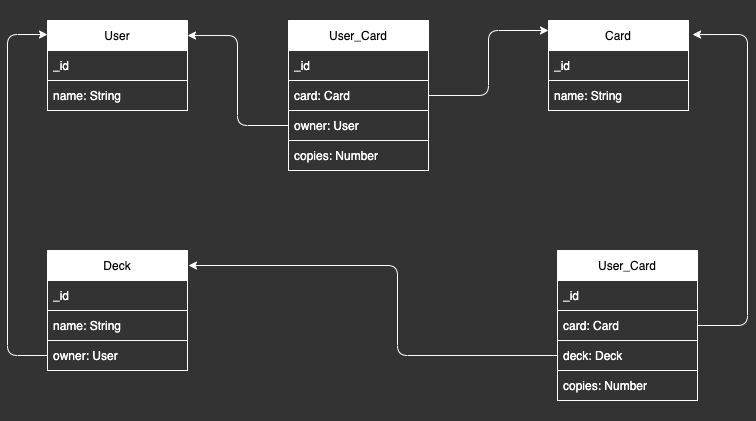

# Taller de desarrollo web


## Getting start

```sh
$ nvm use
$ npm install 
$ npm run start:api
$ npm run start:webapp
```

## Proyecto

Tracker de cartas magic  

### Requerimientos

* Los usuarios tienen mazos, y colecciones de cartas.
* El mazo consisten en un conjunto de 60 cartas, maximo 4 cartas de la misma copia
* El usuario puede agregar cartas a sus colecciones, las cartas pueden estar repetidas
* El usuario puede eliminar cartas a sus colecciones, si tiene mas de una elimina una copia
* El usuario pueden crear mazos
* El usuario pueden listar mazos
* El usuario pueden modificar mazos
* El usuario pueden eliminar mazos
* El usuario puede agragar cartas a un mazo, si agrega la misma carta agraga uan copia de la misma
* El usuario puede eliminar cartas a un mazo, si tiene mas de una elimina una copia
* El usuario puede ver que cartas de su mazo no estan en su coleccion
* El usuario puede listar los mazos de otro usuarios
* El usuario puede clonar el mazo de otro usuario  


### Modelo    
\
   